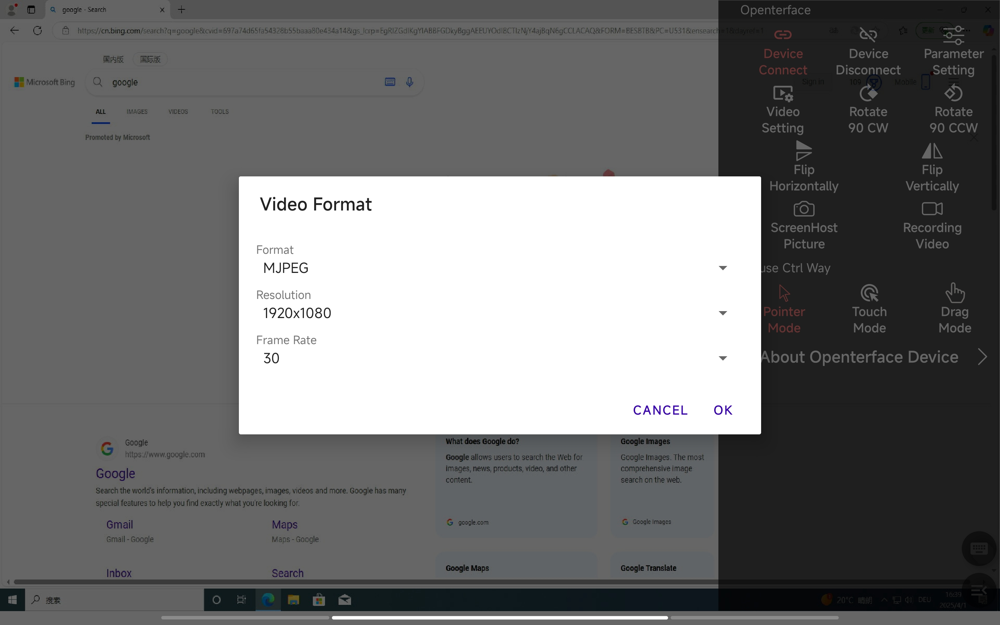
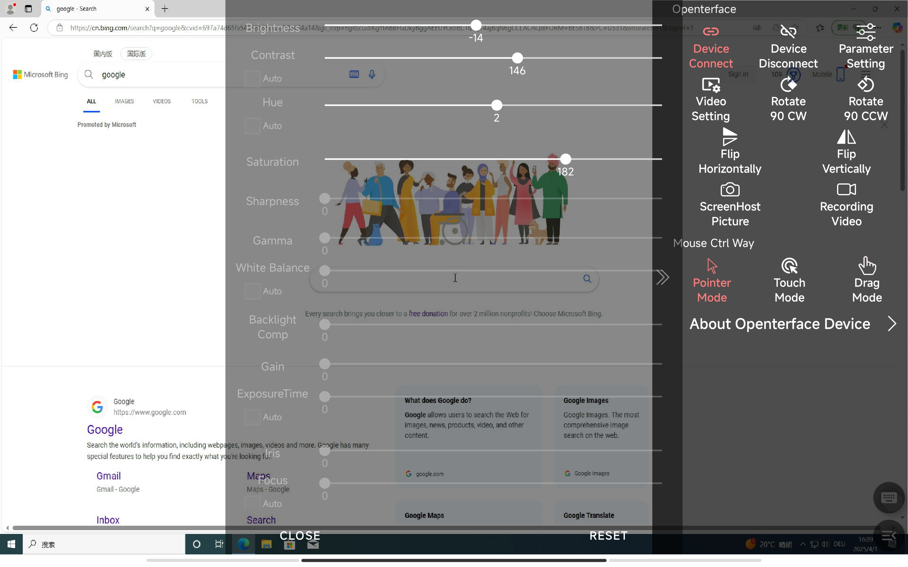
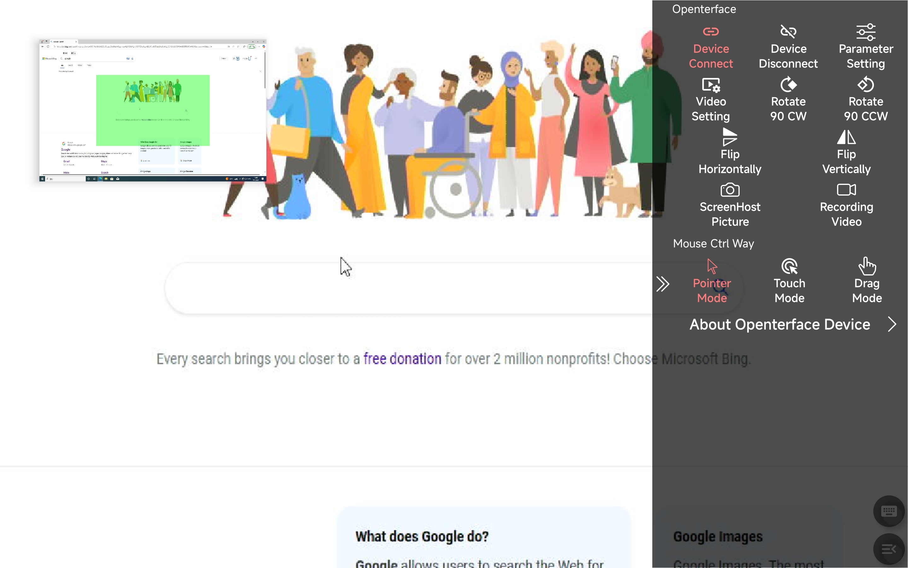
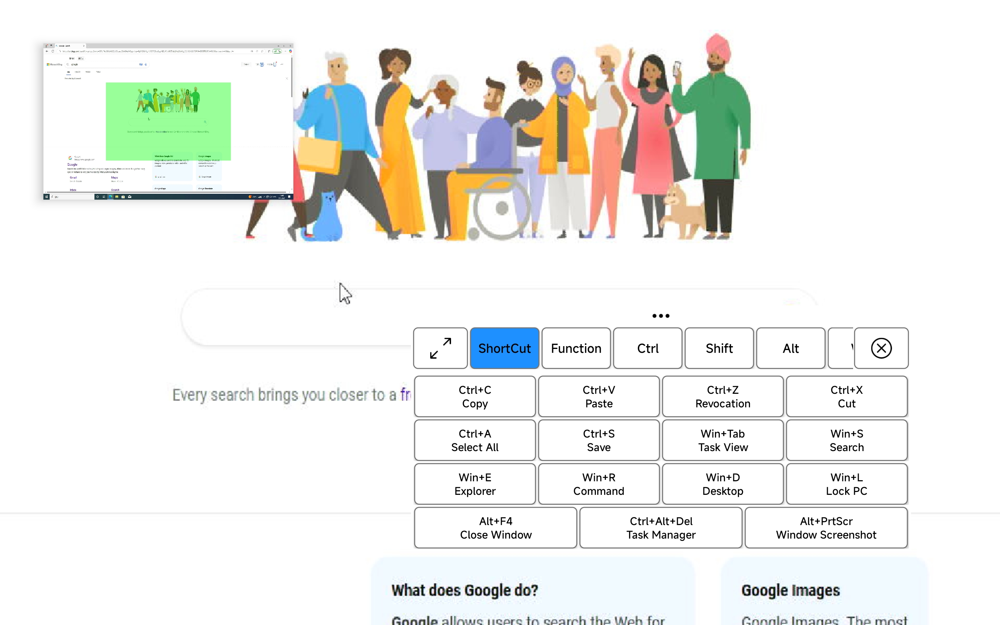

# Welcome to Openterface Mini-KVM Android version

# Openterface Mini-KVM

Welcome to the **Openterface Mini-KVM** project! Our crowdfunding campaign is live on [Crowd Supply](https://www.crowdsupply.com/techxartisan/openterface-mini-kvm). Please consider supporting us by backing our project!


## Overview

Openterface Mini-KVM is an open-source hardware and software solution designed to provide basic KVM (Keyboard, Video, Mouse) functionality for controlling devices via an Android-based interface. This repository contains the Android application source code, build configurations, and supporting scripts to set up and deploy the project.

We are committed to open hardware and open-source software, licensed under the [GNU Affero General Public License v3](LICENSE).
## Feature Modules

### 1. Video Display
#### Main Functionality
- Streams video output from the connected target device to the Android screen in real-time.
- Supports image adjustments for optimal viewing.



#### User Interface Description
- The main screen displays the target device's video feed, occupying most of the interface.
- A toolbar at the side provides adjustment controls (brightness, contrast, hue).

#### Operation Flow
1. Connect the Mini-KVM hardware to the target device via HDMI and USB.
2. Plug the Mini-KVM into your Android device via USB-C.
3. Launch the app; the video feed appears automatically.
4. Use the toolbar sliders to adjust brightness, contrast, or hue as needed.



#### Special Features
- Pair-finger zooming makes the display look better



---

### 2. Mouse Control
#### Main Functionality
- Provides absolute and relative mouse control to interact with the target device’s interface.
- Supports left and right clicks.
- Select mode from the right menu.

#### User Interface Description
- The video feed doubles as a touchpad for mouse input.
- A floating action button (FAB) toggles between mouse and keyboard modes.

#### Operation Flow
1. Make sure the device is connected successfully.
2. Tap the screen to move the mouse cursor to that position (absolute control).
3. Double-click with one finger for left click, Two-finger click for right click.
4. The drag mode is to hold down the left button without releasing it.

#### Special Features
- Relative mouse control (in development, toggle via settings when available).


---

### 3. Keyboard Input
#### Main Functionality
- Allows text input to the target device via an on-screen keyboard.

#### User Interface Description
- A keyboard icon in the FAB toggles the on-screen keyboard overlay.
- The keyboard includes standard keys and function keys (F1-F12).

#### Operation Flow
1. Tap the keyboard FAB to bring up the on-screen keyboard.
2. Type text or press function keys as needed.

#### Special Features or Shortcuts
- **F1-F12 Keys**: Accessible via a dedicated row on the keyboard.
- **Ctrl+Alt+Del**: Tap a shortcut button on the keyboard overlay.



---

## Getting Started

### For Users
1. **Download the App**: Grab the latest release APK from the [Releases page](https://github.com/techxartisan/openterface-mini-kvm/releases).
2. **Install**: Transfer the APK to your Android device and install it (enable "Install from Unknown Sources" if prompted).
3. **Connect Hardware**: Attach the Mini-KVM hardware to your target device and Android device.
4. **Run**: Open the app and start controlling your device.

### For Developers (Debugging with Android Studio)
1. **Clone the Repository**:
   ```bash
   git clone https://github.com/techxartisan/openterface-mini-kvm.git
   cd openterface-mini-kvm
   ```
2. **Open in Android Studio**:
  - Launch Android Studio and select "Open an existing project."
  - Navigate to the cloned repository folder and open it.
3. **Configure SDK**:
  - Edit `local.properties` with your SDK path (e.g., `sdk.dir=C:\\Users\\YourUser\\AppData\\Local\\Android\\Sdk`).
4. **Build and Run**:
  - Sync the project with Gradle (click "Sync Project with Gradle Files").
  - Connect your Android device via USB with debugging enabled.
  - Click "Run" to build and deploy the app to your device.
5. **Debug**: Use Android Studio’s debugger to step through code and test features.

## Common Issues and Solutions (FAQ)

- **Q: The video feed doesn’t appear.**
  - **A**: Ensure the Mini-KVM hardware is securely connected to both the target device and your Android device. Check "Connection Status" in Settings.
- **Q: Mouse clicks aren’t registering.**
  - **A**: Verify absolute mouse mode is active (default). Restart the app if the issue persists.
- **Q: Keyboard input is slow.**
  - **A**: Reduce video quality in Settings to improve performance.

## Contributing

We welcome contributions! See our [Contributing Guide](https://openterface.com/contributing/) or email [info@techxartisan.com](mailto:info@techxartisan.com) to join the team.

## License

Licensed under the [GNU Affero General Public License v3](LICENSE).

---